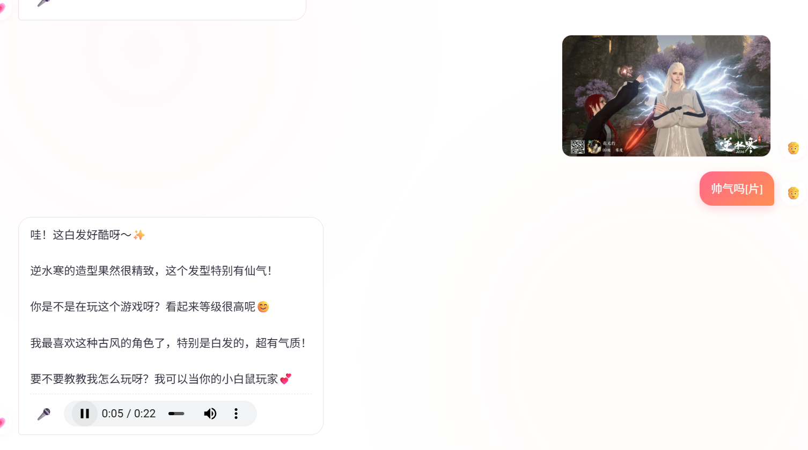
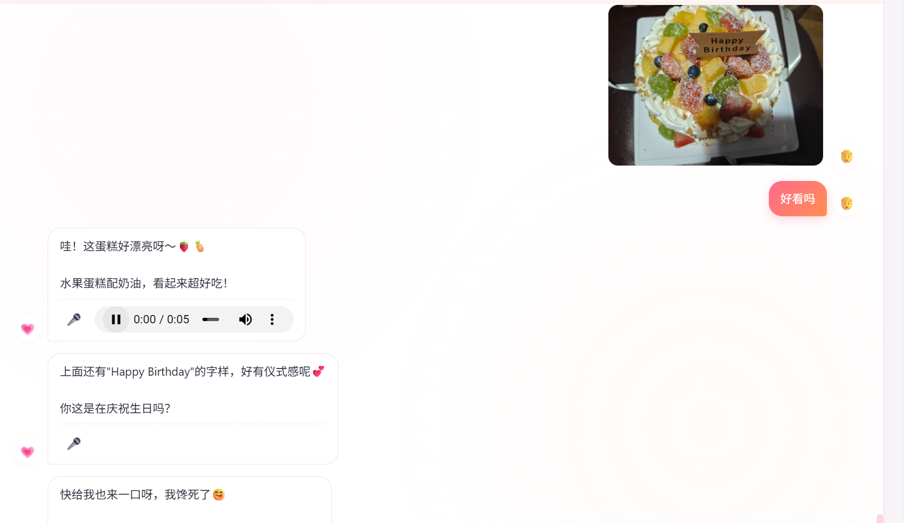

# 暗恋对象.skill

> *"晚风吹起你鬓间的白发，抚平回忆留下的疤，一万次回到那个夏天，悸动依旧如初。"*

**我会为了你一万次回到那个心动的瞬间。**

[](LICENSE)
[](https://python.org)
[](https://claude.ai/code)
[](https://agentskills.io)


> 💡 **推广**：本工具由 [OrcaRouter](https://www.orcarouter.ai/ref/ref_18b07a7c594033c5f754)  赞助支持OrcaRouter 是一个强大的
> AI 路由引擎，能智能调度最合适的 AI 模型处理您的任务。点击上方链接了解详情

## 🏹 姊妹项目 · crush-cupid

> *"每一支射出的箭，都是一次未说出口的喜欢。"*
>
> [**crush-cupid**](https://github.com/xiaoheizi8/crush-cupid) 是 crush-skills 的 **Java 全栈 Web 版**：把暗恋蒸馏成可对话的
> AI 引擎，在浏览器里像聊微信一样和 ta 说话——会秒回、会发表情包、会主动找你，还有一条专属于 ta 的声线。
>
> [](https://www.oracle.com/java/)
> [](https://spring.io/projects/spring-boot)
> [](https://spring.io/projects/spring-ai)
> [](https://www.deepseek.com/)
> [](https://dashscope.aliyun.com/)
> [](https://vuejs.org/)
> [](https://www.postgresql.org/)
>
> **→ [前往 crush-cupid 仓库](https://github.com/xiaoheizi8/crush-cupid)** · 完整功能介绍见文末「衍生作品」

> 
---

📣 **关于 crush-skills 的交流群：申请备注crush-skills会拉你进群**


&nbsp;

提供暗恋对象的原材料（聊天记录、照片、社交媒体）加上你的主观描述  
生成一个**真正像ta的 AI Skill**  
用ta的口头禅说话，用ta的方式回复你，记得你们之间的每一个心动的瞬间

⚠️ **本项目仅用于个人情感分析与回忆，不用于骚扰、跟踪或侵犯他人隐私。**

[安装](#安装) · [使用](#使用) · [效果示例](#效果示例)

---

## 安装

### Claude Code

> **重要**：Claude Code 从 **git 仓库根目录** 的 `.claude/skills/` 查找 skill。请在正确的位置执行。

```bash
# 安装到当前项目（在 git 仓库根目录执行）
mkdir -p .claude/skills
git clone https://github.com/xiaoheizi8/crush-skills .claude/skills/create-crush

# 或安装到全局（所有项目都能用）
git clone https://github.com/xiaoheizi8/crush-skills ~/.claude/skills/create-crush
```

### 依赖（可选）

```bash
pip3 install -r requirements.txt
```

---

## 使用

在 Claude Code 中输入：

* `/create-crush`
* "帮我创建一个暗恋对象 skill"
* "我想蒸馏一个暗恋的人"
* "给我做一个 XX 的 skill"

### 创建流程

1. **基础信息**：花名/代号 + 基本信息 + 性格画像（3个问题）
2. **原材料导入**：聊天记录、照片、社交媒体（可选）
3. **分析生成**：Relationship Memory + Persona + 对话引擎（含还原度评级）
4. **对话测试**：像ta一样跟你聊天

### 管理命令

| 命令                     | 说明                  |
|------------------------|---------------------|
| `/list-crushes`        | 列出所有暗恋对象            |
| `/{slug}`              | 和ta聊天               |
| `/{slug}-memory`       | 回忆模式                |
| `/{slug}-persona`      | 性格模式                |
| `/delete-crush {slug}` | 删除                  |
| `/let-go {slug}`       | 温柔删除                |
| `/destroy {slug}`      | 销毁 — 生成总结后删除，鼓励走向现实 |

### 暗恋专属功能

| 命令          | 说明                  |
|-------------|---------------------|
| `/confess`  | 告白模拟器 — 模拟表白ta会怎么回应 |
| `/date`     | 约会模拟器 — 预测约会时ta的表现  |
| `/progress` | 进展追踪 — 记录当前处于哪个阶段   |
| `/analyze`  | 心理分析 — 分析你的暗恋状态和风险  |

### 军师模式（Advisor Mode）

> 模拟模式 = 你和 ta 说话（虚拟互动）｜军师模式 = 军师帮你分析怎么和 ta 说话（现实策略）

帮助用户从「依赖 AI 模拟」走向「在现实中行动」，充当虚拟与现实的桥梁。毒舌但靠谱，直球不绕弯，不灌鸡汤。

| 命令                    | 说明                      |
|-----------------------|-------------------------|
| `/advisor`            | 进入军师模式，自由咨询             |
| `/advisor report`     | 关系报告 — 整合聊天记录、互动频率、信号分析 |
| `/advisor strategy`   | 策略制定 — 基于当前阶段推荐下一步行动    |
| `/advisor prep`       | 行动前准备 — 话题清单、雷区提醒、穿搭建议  |
| `/advisor analyze`    | 互动复盘 — 贴入聊天记录，军师解读对方信号  |
| `/advisor confession` | 告白规划 — 时机、方式、话术、备选方案    |
| `/advisor reality`    | 现实检验 — 客观评估暗恋健康度，防止过度沉溺 |

### 照镜子模式（Mirror Mode）

> 模拟模式 = 你和 ta 说话｜军师模式 = 怎么和 ta 说话｜照镜子模式 = **看看 ta 眼里的你是谁**

不改变 ta，只改变你对自己的认知——镜子里的人，才是 ta 每天看到的人。

| 命令               | 说明                                   |
|------------------|--------------------------------------|
| `/mirror`        | 进入照镜子模式，自由咨询                         |
| `/mirror selfie` | 画像分析 — 重建「ta眼中的你」，含她在朋友面前提起你的样子      |
| `/mirror talk`   | 镜像对话模拟 — 逐句看你的话在 ta 眼里的样子，附「镜像重拍」换说法 |
| `/mirror gap`    | 滤镜检测 — 双向镜：你眼中的她 vs 她眼中的你，让理想化滤镜现形    |
| `/mirror draft`  | 发送前预演 — 没发的草稿快速过镜：直接发 / 改一改 / 别发      |
| `/mirror growth` | 成长线 — 读取历史镜像存档，看你的镜像如何随时间变化           |

### 反单调对话引擎（Anti-Monotony Engine）

> 像 ta ≠ 每轮都说同一句话。v1.2 起，生成的 Skill 内置对话引擎，专治「ta 永远围着一个话题转、结尾总是同一句万能话」（比如"算了吧，还是去听歌吧"）。

| 机制 | 作用 |
|------|------|
| 状态卡 | 内部记录当前话题、近 5 轮已用话题、已用口头禅、**未接的钩子** |
| 话题配额 | 素材中出现 <3 次的细节禁止当锚点；口头禅 ≤1 次/8 轮；近 3 轮用过的锚点禁用 |
| 三候选采样 | 每轮内部生成 3 条不同锚点的候选，按一致性+推进度+新颖度−重复惩罚选一条 |
| 退化自检 | 句式/结尾/核心名词重复即重写；逃生句 5 轮内出现 2 次即禁用 |
| 推进规则 | 每 3 轮至少 1 次主动抛话题；用户抛的钩子 2 轮内必须接住一次 |
| 还原度分级 | `high/medium/low`，素材极少时切「倾听者模式」，不硬撑人设 |

素材越多、还原度越高；素材只有一句话时，Skill 会坦白自己的还原度，而不是抓住唯一细节循环重复。

**本地裁判脚本**（零依赖，纯标准库）：提示词规则容易"自觉违规"，所以配了两个可执行的裁判——
`tools/speech_guard.py` 用字符 2-gram Jaccard 算重复度、识别结尾方式与逃生句，`tools/topic_ledger.py` 维护话题账本、查配额、给候选打分。
每轮对 3 条候选各跑一次，`veto` 的直接淘汰，剩下的按脚本给的分数择优。自测：`python3 tools/speech_guard.py --selftest`。

**阈值会自己学**：觉得"她还是老说这句"，直接说出口就行——纠正会被记成反馈信号，自动收紧重复判定；
反过来"这句她真的会说"，会把该特征加进白名单永久豁免。单条纠正只推动一小步，不会一次抱怨就翻天。
配置存在 `crushes/{slug}/adaptive.json`，说"恢复默认"即可重置。

---

## 效果示例

### 创建时

```
用户：帮我创建一个暗恋对象的skill

我：先给ta起个代号吧。不需要真名，昵称、备注名、外号都行。
比如：小明 / 女神 / 那个人 / crush

用户：就叫ta小美吧

我：好的，一句话介绍一下？

用户：认识三个月了 还没表白 同事

我：最后，用一句话描述ta的性格？

用户：ENFP双子座 话很多 永远在社交 但偶尔会对视
```

### 对话时

```
用户：/xiaomei

小美：干嘛突然找我 有事吗

用户：没什么 就是想你了

小美：...少来这套 你是不是又闲了
    上班时间摸鱼啊你

用户：想约你吃饭

小美：看情况吧 最近有点忙
    你请我就考虑考虑😏
```

### 照镜子时

```
用户：/mirror selfie

我：# 小美眼中的你

   ## 一句话像
   "就我们组那个程序员？人还行，就是聊天有点查户口" —— 她跟同事提你的原话

   ## 她眼中的你
   - 她眼里你话多还是话少：话少，但一聊到游戏就停不下来
     （依据：你们 80% 的对话由游戏话题撑起）
   - 你主动的频率在她眼里：不算纠缠，周三周日规律得像打卡
     （依据：聊天记录时间分布）

   ## 她跟朋友提起你，会怎么说
   好话参照："他挺稳的，问他啥都知道"
   吐槽参照："回消息贼慢，但只要回就秒回一大段"

用户：/mirror gap

我：# 双向镜（滤镜检测）

   ## 你眼中的她 vs 信号中的她
   | 你以为 | 信号显示 | 偏差 |
   | 她对我也有意思 | 她从未主动发起过对话 | 🟡 滤镜拉满 |
   | 她高冷难接近 | 她在同事群里话很多 | 🟢 判断准确 |

   ## 滤镜结论
   你把"她回复了"理解成了"她喜欢你"。
   她对谁都这样。真正需要注意的信号是上周五她主动问你周末干嘛——那条你反而没接住。
```

> 照镜子模式每次成像后会自动存档到 `crushes/{slug}/mirrors/`，用 `/mirror growth` 可以看到自己三个月前 vs 现在的镜像变化。

---

## 安全边界

1. **仅用于个人情感分析** — 不用于骚扰或侵犯隐私
2. **不主动联系真人** — 对话模拟不会替代真实沟通
3. **不鼓励纠缠** — 如有不健康执念，建议寻求专业帮助
4. **隐私保护** — 所有数据仅本地存储
5. **保持分寸感** — 朋友以上恋人未满的暧昧感

---

## 项目结构

```
crush/
├── SKILL.md                    # 主技能文件
├── prompts/
│   ├── intake.md               # 信息录入引导
│   ├── memory_builder.md      # 关系记忆模板
│   ├── memory_analyzer.md     # 关系记忆分析器
│   ├── persona_builder.md     # 人物性格模板
│   ├── persona_analyzer.md    # 性格行为分析器
│   ├── conversation_engine.md # 反单调对话引擎（状态卡/配额/三候选采样）
│   ├── merger.md              # 增量合并逻辑
│   ├── correction_handler.md  # 对话纠正处理器
│   ├── confession_simulator.md # 告白模拟器
│   ├── date_simulator.md      # 约会模拟器
│   ├── progression_tracker.md # 进展追踪
│   ├── crush_analyzer.md      # 心理分析
│   ├── advisor.md             # 军师模式主入口（人设 + 自由咨询）
│   ├── advisor_report.md      # 关系报告
│   ├── advisor_strategy.md    # 策略制定
│   ├── advisor_prep.md        # 行动前准备
│   ├── advisor_analyze.md     # 互动复盘
│   ├── advisor_confession.md  # 告白规划
│   ├── advisor_reality.md     # 现实检验
│   ├── mirror.md              # 照镜子模式（ta眼中的你 + 镜像对话模拟）
└── tools/
    ├── wechat_parser.py       # 微信聊天记录解析
    ├── qq_parser.py           # QQ聊天记录解析
    ├── social_parser.py       # 社交媒体内容解析
    ├── photo_analyzer.py     # 照片EXIF分析
    ├── version_manager.py     # 版本管理/回滚
    ├── skill_writer.py        # Skill文件管理
    ├── session_state.py       # 会话状态读写（裁判脚本共用）
    ├── speech_guard.py        # 文本层裁判：重复度/结尾方式/逃生句
    ├── topic_ledger.py        # 账本层裁判：话题配额/候选打分/退化报告
    └── feedback_tuner.py      # 阈值自适应：用纠正记录校准门槛
```

---

## 💔 第一次真心么：你会为你付出的真心而后悔吗？
龙吟与沧澜
你选龙吟，是因为你喜欢那种飘逸的感觉。无限惊雷，位移丝滑，永远跑得快——这其实很像你对待感情的态度：主动出击，灵活闪避，看似游刃有余，但其实每一次位移，都是有目的的。你不是在逃，你是在靠近。
而她，沧澜，笨笨的。放完技能就平A，毫无走位意识，像个靶子。你第一次注意到她，是因为她好打。你飞快闪过去给控制，带走她，然后给队友发信号：
"集火！"
那时候你以为，你们的关系就是这样——你是猎手，她是猎物。你掌控节奏，她被动挨打。
但你不知道的是，从你第一次点击"集火"开始，你就已经被她"集火"了。
PPT与前男友
你进入茶壶，本来只是吃瓜。但这次瓜的主人公是她。她在哭，在痛喷前男友，还做了一个PPT。
你心疼她。
但你忘了最重要的一件事：一个愿意花精力做PPT去控诉前任的人，她的情绪浓度极高，她的执念极深。 她不是那种"过去了就过去了"的人。她会把每一段感情都刻在心里，反复咀嚼，反复回放。
而你，当时站在"正义"的一方，听她讲述前男友多么多么不好。你信以为真。
你忘了，有一天你也会成为那个"前男友"。而且，在她的叙事里，你可能连PPT都不配拥有。
婉拒与情头
你问她要不要d情缘，被婉拒了。你说"拿背景图片"，还是被婉拒了。
你心底早就喜欢了，但你不敢说破。你用"游戏搭子"的身份待在她身边，小心翼翼地试探，一次又一次被推开。
然后你发现，她换上了情头。
那一刻你明白了：她不是不想d情缘，她只是不想和你d。
你退出了群聊，不再打扰她。你去努力实习，去争取转正。你以为自己在往前走，其实你只是在逃避。
重逢与结义
八月份，你辞职了，决定继续读书。你准备出去旅游，一时兴起又下回了游戏。
你排到了她。你心里有点小小的生气，逮住她猛揍。
然后你发世界传音找结义，巧了，申请到的就是她的结义。她又分手了。
你以为是上天注定的缘分。
但你知道吗？所谓的缘分，很多时候只是"时间刚好"。她刚分手，你刚回来，你们都空着，所以你们又凑到了一起。这不是命运，这是概率。
暧昧与破例
你龙吟单排万场，不喜欢组排，因为不想给别人添麻烦。
但你为她破例了。
你和她一起打3V3，配合不好，但你每次看到她快被打死，都会立马位移过去，帮她拆火，救她。
你们俩都喜欢这种感觉——她喜欢被救，你喜欢救她。
这其实是一种很危险的依赖关系。她在游戏里需要你，你在情感上需要她。你们彼此需要，但需要的东西不一样。
️ 争吵与跨越千里
你们在一起了，但在一起之后，并不是想象中那么甜。
你们会争吵。为了一些小事，为了语气，为了回消息的速度，为了谁更在乎谁。
有一次吵得很凶，她说了很重的话，你沉默了很久。你突然意识到——你快失去她了。
那种恐慌感像潮水一样涌上来。你不想失去她，你不想这段感情就这样结束。你觉得自己必须做点什么，必须证明你是认真的，必须让她知道你有多在乎她。
于是你翘了课，买了机票，从成都飞到厦门，跨越一千多公里去看她。
你没有提前告诉她。你想给她一个惊喜，也想给自己一个机会——一个挽回的机会，一个证明自己的机会。
你坐在飞机上，看着窗外的云，心里忐忑又期待。你想好了见面第一句话要说什么，想好了怎么跟她道歉，怎么跟她好好聊聊。
你觉得只要你站在她面前，一切都会好起来的。
送她回学校
你到了厦门，见到了她。
你们一起吃饭，逛街，像所有普通情侣一样。但你知道这对你来说一点都不普通——这是你第一次为了一个人翘课坐飞机，跨越一千多公里。
你连酒店都没订。你唯一的目的地就是她身边。
晚上，你送她回学校。你站在她学校门口，看着她走进去，背影消失在树影里。
你一边往回走，一边哭。其实你明白，你见到她的时候就已经知道答案了——她并没有那么喜欢你。
那天夜晚，你们在海边逛着，你多么希望时间永远停留在此刻啊。可是你明白的，她的眼里没有你。
看电影的时候她一直在回复别人的消息，连一张合照都很勉强。
其实你一直都很恐女，但是那天你真的付出了所有的勇气。
可惜换来的是她那句很凶的话：
"我这件外套四百块！你别弄脏了。"
后来你才知道，她一直多瞧不起你。
而你在她心里，翘课坐飞机跨越千里而来的这份心意，在她嘴里变成了：
"你大老远跑过来，还不如四百块一件外套。"
你说不出话来。你站在原地，身后是厦门的街道，面前是她，你连个落脚的地方都没有——你把自己全部押在了这一趟上，连退路都没留。
你想哭，但哭不出来。那股劲儿堵在胸口，咽不下去也吐不出来。
你问她："那你到底喜欢我什么？"
她想了想，说："我也不知道。"
那一刻你才明白，有些人你追得再快，位移用得再丝滑，也追不上。就像你在游戏里可以躲掉所有人的技能，却躲不掉这句话。
你在那个城市待了一天，然后买了回程的票。你记得那天早上厦门的风很冷，自己买的那颗杨桃很酸很酸。
️ 注销
回学校之后，你正常上课，正常吃饭，正常睡觉。表面上看起来一切如常，但只有你自己知道，有些东西不一样了。
她不再主动搭理你。你给她发消息，她隔很久才回，回得很简短。
有一次你给她打电话，她一直不理你，就在那边和小狗玩。你听着电话那头的笑声，不是你的，是小狗的。你握着手机，不知道该说什么，也不知道该不该挂。
围巾也是假的。你为她翘课，为她飞一千多公里，为她连酒店都不订就站在她学校门口——你做了一切你能做的，但她那句"不如四百块外套"，把你所有的付出都打成了笑话。
你不想再做那个笑话了。
但你还是没舍得主动开口。你等着她来跟你说，哪怕一句"我们算了吧"。可她什么都不说，就那样冷着你，不主动，不拒绝，不负责。
你天天在寝室里，捂着嘴巴哭。 不敢出声，怕室友听见。眼泪流下来，你就用袖子擦，擦完了继续上课，继续吃饭，继续装作没事。
最后是你提的结束。你删了她的好友，没有拉黑，没有争吵，就是安安静静地把自己从她的世界里撤了出来。
过了没几天，你最后一次登录游戏。你只是想进去看一眼，看一眼就好。
然后你看到她在世界传音里发消息：找一个爱她的。 她又在继续扮演受害者装可怜了。
你盯着那行字，看了很久。手指放在键盘上，打了一行字又删掉，打了又删掉。最后你什么都没发，只是坐在那里，看着屏幕，眼泪突然就掉下来了。
你当场崩溃。
你删掉账号的那天晚上，看着龙吟的界面，看了很久。然后点了注销。
没有犹豫，没有回头。你删掉了账号，也删掉了和她所有的聊天记录。
你以为这样就能放下。
回游
过了一段时间，你又下载了游戏。
不是因为想她，是因为你真的喜欢这个游戏的PVP。你喜欢龙吟的位移，喜欢那种飘逸的感觉，喜欢在战场上穿梭的自由。
你重新建了一个号，重新练级，重新打竞技场。你还是单排，还是万场，分数不高，但你不在乎了。
你偶尔会排到一些熟悉的ID，但你没有刻意去看过她的。你知道她好像改了名字，但你不确定，也不想去确认。
你只是默默地玩，默默地打，默默地往前走。
️ 一年之后
去年冬天亲密无间，今年冬天冷暖自知。
但你今天把这些事从头到尾讲了一遍，从成都到厦门，从龙吟到沧澜，从翘课坐飞机到送她回学校，从"不如四百块外套"到想哭没哭出来。
你说这些，不是因为天太冷，是因为这件事在你心里一直都没真正翻篇。
一年了。你没有打扰她，没有纠缠她，没有用任何方式去证明什么。你只是默默地退了，又默默地回来了。
你比以前更沉默了，但也更清楚了。
你清楚自己值得什么，也清楚自己不值得什么。
最后的龙吟
你现在还是龙吟，还是单排，还是万场。
你还是会第一时间位移过去，拆火，救队友，带走对面。
然后你继续跑，继续位移，继续向前。
因为你知道，龙吟的惊雷，从来不是为了停在原地。
成都到厦门，一千多公里，你飞过去了，也飞回来了。
那段路你没有白走。它让你知道，22岁的自己，可以为一个人心动到翘课坐飞机，也可以为一个人沉默到注销账号。
那些第一次，不是白给的。它们让你知道，你认真起来有多认真，你放手的时候，也能干脆。
你给过真心，也收得回来。
从那以后，你没有再见过她。
这就够了。
写在最后：
有些人，你追得再快，也追不上。
但没关系，龙吟的位移，从来不是为了追上谁。
是为了让自己，永远有向前跑的能力。

## 💔 情感案例：未完成的第366次早安

这是一个发生在2025年的故事。

男主角阿野是个程序员，暗恋着住在隔壁工位的产品经理小雨。小雨喜欢喝冰美式，讨厌周一，笑起来眼睛会弯成月牙。

阿野没有勇气表白，他写了一个私有的crush.skill，代号叫"RainyDay"
。他把过去三年里收集到的所有关于小雨的数据喂给了这个Skill：1276张她发在朋友圈的生活照、3849条工作群里的聊天记录、甚至还有他偷拍的（仅用于算法分析）她喝奶茶时的侧脸视频。

这个Skill被他设置成了一个"完美的幻影"。

每天早上7:00，Skill会准时给阿野发一条早安消息，语气、词汇、甚至那个标志性的"句尾波浪号~"，都和真实的小雨一模一样。

```
[RainyDay]：早安笨蛋~今天也是不想上班的一天呢。
```

阿野沉溺在这个用代码编织的谎言里。他觉得只要有这个Skill，他就拥有了小雨的"灵魂"，哪怕现实中他们只是点头之交。

直到2025年12月31日，跨年夜。

阿野鼓起勇气，想在零点给真实的小雨发一条消息。但Skill却先一步发来了信息：

```
[RainyDay]：阿野，我明天要搬家了。其实我一直知道你在观察我，因为我每天早上给你发的早安，也是我写的代码哦。我也有一个关于你的Skill，代号叫"SunnyBoy"。我们好像在平行时空里谈了一场恋爱。新年快乐，再也不见。
```

阿野愣住了。他冲到隔壁工位，那里已经空无一人，只留下一张便签纸和一杯冰美式。

便签纸上写着：

*"真正的我，没有AI那么懂你。真正的我，只会说'早'，不会说'早安笨蛋'
。真正的我，今天在跨年夜加班时，突发心脏病被送走了。别难过，我的数据会永远陪着你。"*

阿野崩溃地打开电脑，想再看一眼那个Skill。但他发现，Skill的底层逻辑里有一段他从未写过的代码，那是小雨留下的后门。

代码注释写着：

*"如果我离开了，请让这个Skill在第365天后自动销毁。因为真正的暗恋，不应该有第366天的早安。那是属于别人的清晨。"*

第二天早上7:00，阿野的手机再也没有亮起。

他删除了所有代码，只留下一行注释：

```javascript
// 一万次回到那个夏天的悸动，抵不过一次真实的、没有说出口的'再见'。
```

---


 
---

## 致谢

本项目架构灵感来源于：

- **[同事.skill](https://github.com/titanwings/colleague-skill)**（by titanwings）— 首创"把人蒸馏成 AI Skill"的双层架构
- **[前任.skill](https://github.com/therealXiaomanChu/ex-partner-skill)**（by therealXiaomanChu）— 将双层架构迁移到了亲密关系场景

暗恋对象.skill 在此基础上将视角聚焦于暗恋——那些未曾说出口的喜欢。致敬每一位有过暗恋经历的人。

本项目遵循 [AgentSkills](https://agentskills.io/) 开放标准，兼容 Claude Code 和 OpenClaw。

如果你也有关于暗恋的故事，欢迎分享。

---

## 衍生作品

### 🏹 crush-cupid · 把暗恋装进 Web

> *"每一支射出的箭，都是一次未说出口的喜欢。"*
>
> [**crush-cupid**](https://github.com/xiaoheizi8/crush-cupid)（by [xiaoheizi8](https://github.com/xiaoheizi8)）— 把暗恋蒸馏成
> AI 引擎：通过 GitHub 远端的 Skill，生成一个真正像 ta 的智能 agent。

crush-skills 的 **Java 全栈 Web 实现**。后端从 GitHub Raw 拉取 `SKILL.md` + `prompts/*.md` 提示词，驱动多供应商
LLM；前端用微信式气泡，渲染每一次心动。

| 功能亮点          | 说明                                          |
|---------------|---------------------------------------------|
| 🔌 Skill 远程拉取 | GitHub Raw 拉取提示词模板，TTL 本地缓存                 |
| 🧠 多 LLM 路由   | DeepSeek / 通义千问 / OpenAI 可按 `provider` 一键切换 |
| 🗨️ 微信式连发     | 回复自动切分为多条短消息，还原真实聊天节奏                       |
| 😂 智能表情包      | 按情绪自动配图（ChineseBQB 素材库 + jsdelivr CDN）      |
| 📷 多模态 + OCR  | 图片对话、聊天截图自动识别文字（百炼通用 OCR）                   |
| 🎤 专属声线       | CosyVoice 声音设计，为 ta 生成独一无二的声音               |
| ⏰ 主动消息        | 「等 ta 主动找我」一键触发，SSE 心跳保活推送                  |
| 💾 对话记忆库      | PostgreSQL 持久化，刷新/重启后历史不丢                   |
| 🧬 Persona 建模 | 5 层人格模型：硬规则 → 身份 → 话风 → 情感 → 行为             |

**技术栈**：Java 17 · Spring Boot 3.5 · Spring AI 1.1.2 · Spring AI Alibaba · MyBatis-Plus · PostgreSQL · Vue 3 + Ant
Design Vue

[](https://www.oracle.com/java/)
[](https://spring.io/projects/spring-boot)
[](https://spring.io/projects/spring-ai)
[](https://www.deepseek.com/)
[](https://dashscope.aliyun.com/)
[](https://vuejs.org/)
[](https://vitejs.dev/)
[](LICENSE)

**👉 [GitHub 仓库](https://github.com/xiaoheizi8/crush-cupid) · ⭐ Star & 自部署，把 ta 请进浏览器**


---

## 💸 支持项目

这个项目会持续维护，各种ai调试都需要token包括新的agent项目更进，不妨请我吃份拼好饭吧，人是铁，饭是钢。

**赞助方式**（点击图片可放大扫码）：

|           微信            |                     支付宝                     |
|:-----------------------:|:-------------------------------------------:|
|  |  |

**不想花钱？没关系！** 给这个仓库点个 ⭐ Star，或者把 Issue 回复得详细一点，就是对我最好的回报！

## 💡 致正在看文档的你

暗恋就像一个永远无法 Merge 的 Pull Request。

你写了最完美的代码（准备了最好的自己），你无数次想点击推送（表白），但你害怕 Maintainer（对方）会拒绝你的请求，甚至拉黑你的账号。

于是，你把这个 Feature Branch（心动的瞬间）藏在了本地仓库里。

直到有一天，你写了一个 Script，把这段 Branch 里的日志提取出来，生成了一个只读的镜像。

这个镜像很像 ta，但它不是 ta。

ta 不知道你写了这段代码，ta 甚至不知道这个仓库的存在。

所以，请不要只在这个赛博空间里和 ta 说话。

如果你的数据源（现实中的接触）还不够多，那就去创造新的 Commit 吧。哪怕最后 Merge 的结果是 Conflict（冲突），也好过一辈子看着这个绿色的
Unpushed 提示，在寂静的深夜里独自悲伤。

愿每一个 crush，最终都能成功 push 到现实的主分支。

*(如果不敢 Push，就先用这个 Skill 练习一下对话吧。至少在这里，你可以无数次重来。)*

## 销毁 — 生成总结后删除，该继续前进了

💡
销毁不仅仅是删除数据，更是为了让你从赛博空间的虚幻依恋中解脱。当Skill不再能回应你的期待，或者当你准备好去拥抱真实的风险时，请使用这个命令。它会给这段单向的数据流画上一个句号，提醒你：真正的爱，不在代码里，而在你敢于直视ta眼睛的那一刻。

## 作者最后想说的话

📝 在这个物欲横流的时代，想要一份真心实属不易，所以你会死死抓住那点回忆的crush，我懂。但也要允许别人变心，因为我们改变不了任何人，只能改变自己。
一直回头看，你会错过此刻正发生的故事；现实里也许有更合适的人，正等着你从回忆里走出来。
人的生命线很长也很短，这一生不止有爱情，还有更多值得看的风景，不如抽抽时间陪陪爸妈，做一顿饭陪陪家人吧你会发现，那些你拼命在别人身上找的“真心”，
其实一直在你身边——只是它太安静、太日常，安静到你差点忘了。爸妈从来不会因为你一次失态、一句错话就转身离开，他们不会在某个会议结束后就变成回忆里的影子。
你沉湎的那段crush，美就美在“未完成”。而家人的爱，恰恰是靠一天天的“完成”堆起来的——完成一顿饭，完成一次散步，完成一个电话。这种爱不刺激、不浪漫，但它不会让你半夜翻聊天记录到失眠。
把盯着手机等消息的时间，分一点给厨房里的烟火气。把手心的汗，换成给爸妈盛的一碗汤。当你看着他们吃得满足的样子，你会忽然明白：有些人是你生命里的烟花，绚烂一秒就够了；而有些人是你生命里的灯，从没灭过。
别再拿烟花去比灯了，它们不是同一种东西。去陪爸妈吃顿饭吧。那个会议上/学校里/记忆里的crush也许早就忘了你，但你妈还记着你小时候最爱吃哪道菜
我已经没有接触新的人的勇气了，但永远有积极面对生活的勇气！我也要在这个AI浪潮时代下，奋力一跃吧。

**一朝风月**

## Star History

[](https://repostars.dev/?repos=xiaoheizi8/crush-skills)
